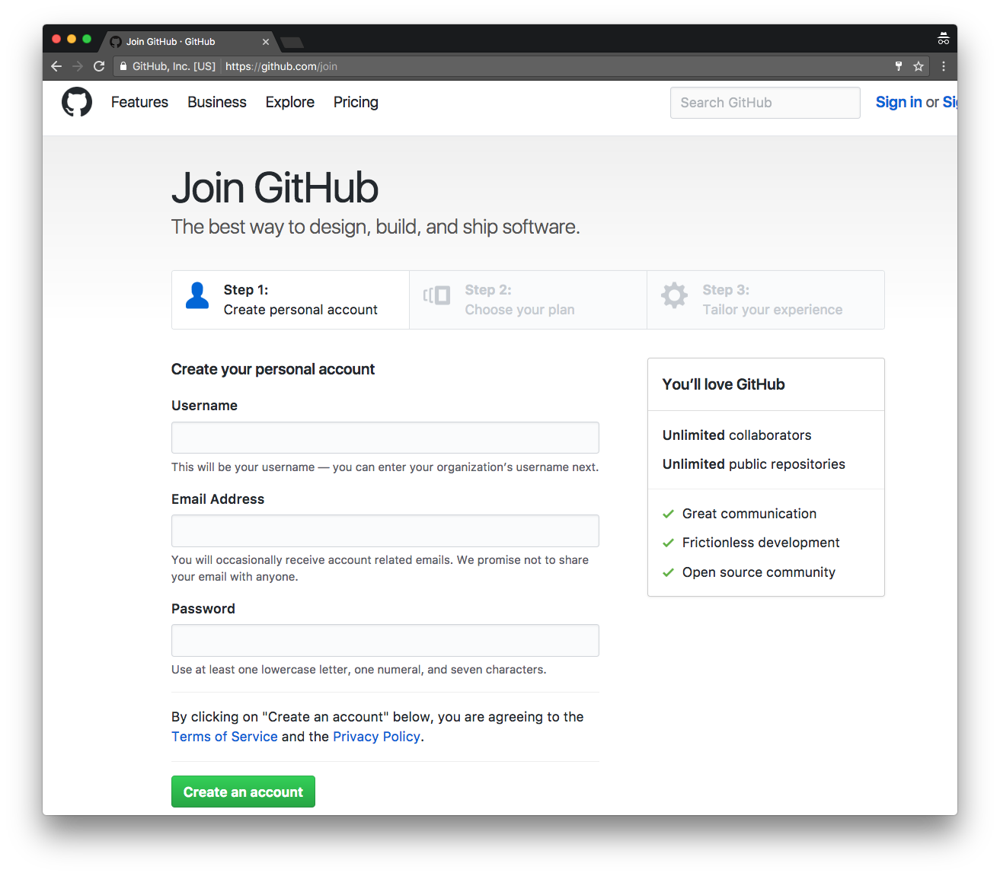

# HMS Research Computing: Introduction to Git and Github

## Welcome

Welcome to Introduction to Git and Github.

### Term: Fall 2018

### Instructor: Mike McClellan <mike_mcclellan@hms.harvard.edu>

### Date: 2017-04-12 3pm-5pm

## Registering for Github

First things first, we should probably register for a Github account if you don't already have one. Registering for Github is free and easy. All we need is a username, email, and password. Github sends a **Verification Email** that may take a couple of minutes, so we should probably get that process started.

Please navigate to [Join GitHub](https://github.com/join). The page should look like the figure below:

---

## Contact information

- [HMS RC website](http://rc.hms.harvard.edu)
- [rchelp@hms.harvard.edu](mailto:rchelp@hms.harvard.edu)
- Office Hours: Wednesdays 1-3p Gordon Hall 500
